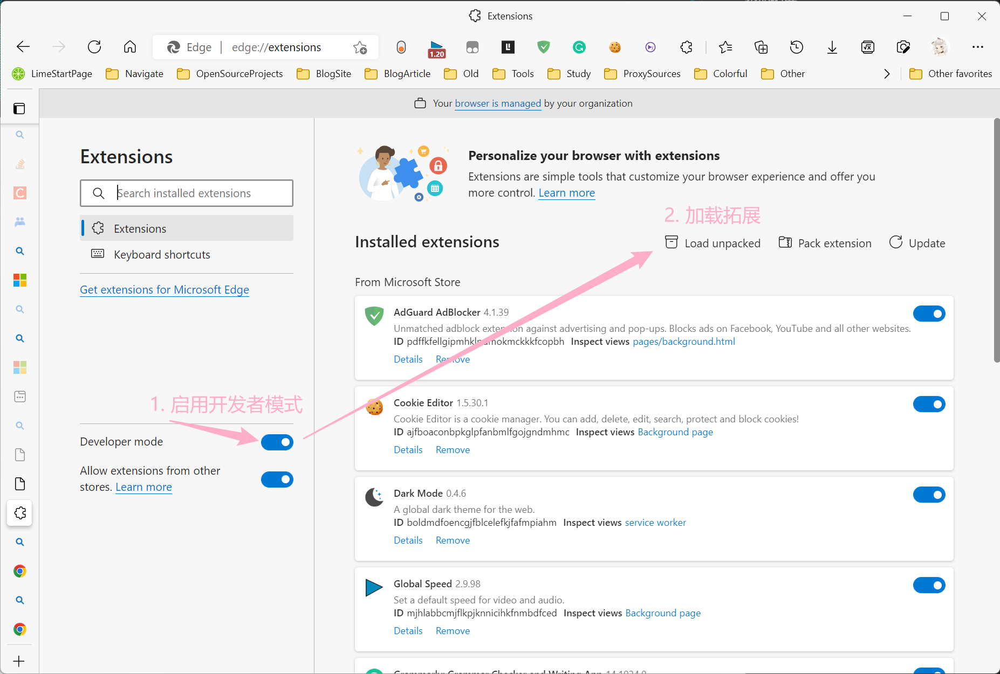

# LiveMessagePosting

Chrome 拓展: 直播间消息推送. 这个拓展可以帮助你将直播间的聊天信息, 通过 HTTP 推送到你想要的地方.

例如, 你有一个程序需要与观众互动, 那么只需要让你的程序监听 HTTP, 然后使用这个拓展进行推送即可.

## 手册:

### 添加拓展

1. 克隆项目到本地
2. 打开浏览器拓展的 "开发者模式"
3. 加载拓展

### 使用拓展

1. 打开支持平台的直播间
2. 点击拓展按钮, 然后点击 "开始"
3. 输入上报地址, 然后确认

 